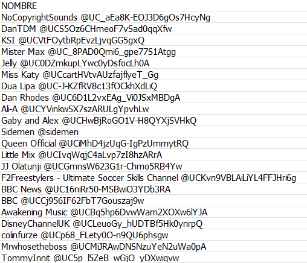
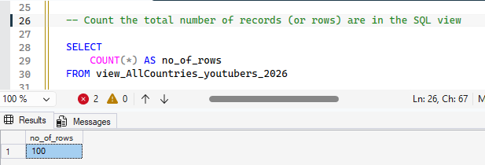
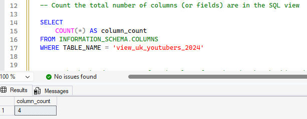
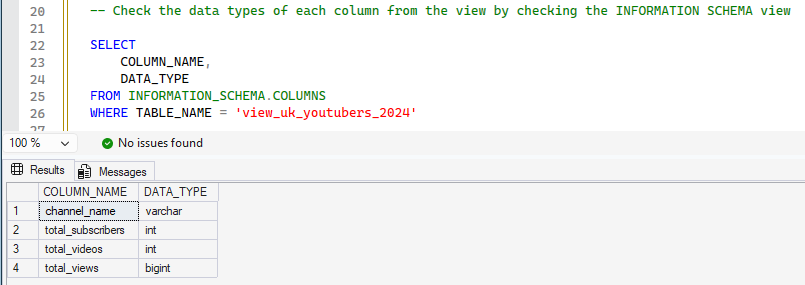
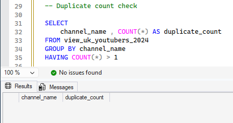
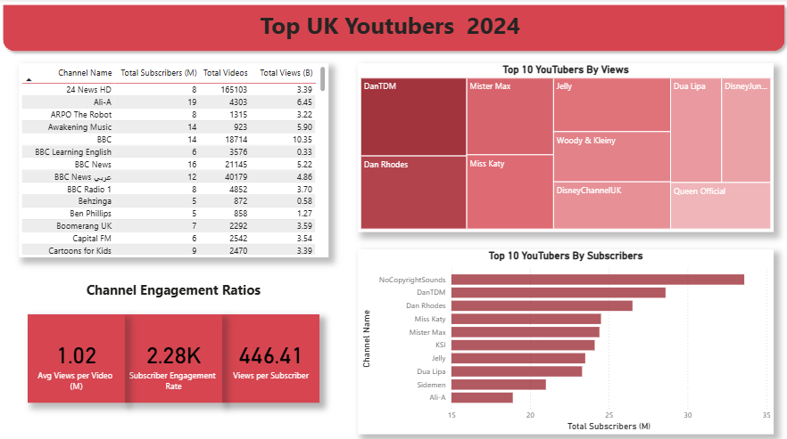

# YouTube2024-Marketing-Analytics-Project

# Table of Contents

- [Project Overview](#Project-Overview)
- [Objective](#objective)
- [Key Metrics & Scope](#Key-Metrics-&-Scope)
- [Data Source](#Data-Source)
- [Steps of Project](#Steps-of-Project)
- [Design](#Design)
  - [Dashboard Components Required](Dashboard-Components-Required)
  - [Dashboard mockup](#Dashboard-mockup)
  - [Tools](#Tools)
- [Developement](#Developement)
  - [Project Workflow](#Project-Workflow)
  - [Data Cleaning](#Data-Cleaning)
  - [Transform the Data](#Transform-the-Data)
  - [Create the SQL View](#Create-the-SQL-View)
- [Data Testing](#Data-Testing)
  - [Row Count Check](#Row-Count-Check)
  - [Column Count Check](#Column-Count-Check)
  - [Data Type Check](#Data-Type-Check)
  - [Duplicate Count Check](#Duplicate-Count-Check)
- [Visualization](#Visualization)
  - [Dax Measures](#Dax-Measures)


# Project Overview

This project aims to help the marketing team make effective decisions in selecting the Top UK YouTubers in 2024 for campaign collaborations as efficiently as possible.

It addresses the issue of scattered and inconsistent data through a systematic workflow, starting from collecting data from Kaggle, organizing and validating it using SQL, and presenting the results through a Power BI dashboard to analyze ROI and investment efficiency.

# Objective

To discover the top performing UK Youtubers to form marketing collaborations with throughout the year 2024.

# KPIs & Scope

This project focuses on analyzing the Top 100 YouTubers in the UK, using the following KPIs :

- subscriber count
- total views
- total videos, and
- engagement metrics

# Data Source 

Key data used in the analysis to achieve the project objectives.

- channel names
- total subscribers
- total views
- total videos uploaded

# Steps of Project

- Design
- Developement
- Testing
- Visualization
- Analysis

# Design 

## Dashboard Components Required 

1. Who are the top 10 YouTubers with the most subscribers?
2. Which 3 channels have uploaded the most videos?
3. Which 3 channels have the most views?
4. Which 3 channels have the highest average views per video?
5. Which 3 channels have the highest views per subscriber ratio?
6. Which 3 channels have the highest subscriber engagement rate per video uploaded?

## Dashboard mockup

## Tools

| Tool | Purpose |
| --- | --- |
| Excel | Exploring the data |
| SQL Server | Cleaning, testing, and analyzing the data |
| Power BI | Visualizing the data via interactive dashboards |

# Developement

## Project Workflow

1. Get the data
2. Explore the data in Excel
3. Load the data into SQL Server
4. Clean the data with SQL
5. Test the data with SQL
6. Visualize the data in Power BI
7. Generate the findings based on the insights

## Data Cleaning

Problem Identified : The NOMBRE column contains both the channel name and the handle (ID) concatenated together, separated by the "@" symbol. To ensure analytical accuracy, it is necessary to extract only the channel name.



## Transform the Data

```sql

SELECT
    CAST(SUBSTRING(NOMBRE, 1, CHARINDEX('@', NOMBRE) - 1) AS VARCHAR(100)) AS channel_name,
    total_subscribers,
    total_videos,
    total_views
FROM 
    top_uk_youtubers_2024

```

## Create the SQL View

```sql

CREATE VIEW view_uk_youtubers_2024 AS

SELECT
    CAST(SUBSTRING(NOMBRE, 1, CHARINDEX('@', NOMBRE) - 1) AS VARCHAR(100)) AS channel_name,
    total_subscribers,
    total_videos,
    total_views
FROM 
    top_uk_youtubers_2024

```

# Data Testing 

- Row count check
- Column count check
- Data type check
- Duplicate count check

## Row Count Check 
### SQL query
```sql

-- Count the total number of records (or rows) are in the SQL view

SELECT 
	COUNT(*) AS no_of_rows
FROM view_uk_youtubers_2024

```
### Output


## Column Count Check 
### SQL query
```sql

-- Count the total number of columns (or fields) are in the SQL view

SELECT 
	COUNT(*) AS column_count
FROM INFORMATION_SCHEMA.COLUMNS
WHERE TABLE_NAME = 'view_uk_youtubers_2024'

```
### Output


## Data Type Check 
### SQL query
```sql

-- Check the data types of each column from the view by checking the INFORMATION SCHEMA view

SELECT 
	COLUMN_NAME,
	DATA_TYPE
FROM INFORMATION_SCHEMA.COLUMNS
WHERE TABLE_NAME = 'view_uk_youtubers_2024'

```
### Output


## Duplicate Count Check 
### SQL query
```sql

-- Duplicate count check

SELECT 
	channel_name , COUNT(*) AS duplicate_count
FROM view_uk_youtubers_2024
GROUP BY channel_name
HAVING COUNT(*) > 1

```
### Output


# Visualization



## Dax Measures

### 1. Total Subscribers (M)
```sql

Total Subscribers (M) = 
VAR million = 1000000
VAR sumOfSubscribers = SUM(view_uk_youtubers_2024[total_subscribers])
VAR totalSubscribers = DIVIDE(sumOfSubscribers,million)
RETURN totalSubscribers

```

### 2. Total Views (B)
```sql

Total Views (B) = 
VAR billion = 1000000000
VAR sumOfView = sum(view_uk_youtubers_2024[total_views])
VAR totalViews = DIVIDE(sumOfView,billion)
RETURN totalViews

```

### 3. Total Videos
```sql

Total Videos = 
VAR totalVideos = sum(view_uk_youtubers_2024[total_videos])
RETURN totalVideos

```

### 4. Average Views Per Video (M)
```sql

Avg Views per Video (M) = 
VAR sumOfTotalViews = sum(view_uk_youtubers_2024[total_views])
VAR sumOfTotalVideo = sum(view_uk_youtubers_2024[total_videos])
VAR AvgViewsperVideo = DIVIDE(sumOfTotalViews,sumOfTotalVideo,BLANK())
VAR finalAvgViewsPerVideo = DIVIDE(AvgViewsperVideo,1000000,BLANK())
RETURN finalAvgViewsPerVideo

```

### 5. Subscriber Engagement Rate
```sql

Subscriber Engagement Rate = 
VAR sumOfTotalSubscribers = SUM(view_uk_youtubers_2024[total_subscribers])
VAR sumOfTotalVideo = SUM(view_uk_youtubers_2024[total_videos])
VAR subscriberEngagementRate = DIVIDE(sumOfTotalSubscribers,sumOfTotalVideo,BLANK())
RETURN subscriberEngagementRate

```

### 6.Views Per Subscriber
```sql

Views per Subscriber = 
VAR sumOfTotalViews = sum(view_uk_youtubers_2024[total_views])
VAR sumOfTotalSubscriber = sum(view_uk_youtubers_2024[total_subscribers])
VAR viewsPerSubscriber = DIVIDE(sumOfTotalViews,sumOfTotalSubscriber,BLANK())
RETURN viewsPerSubscriber

```
