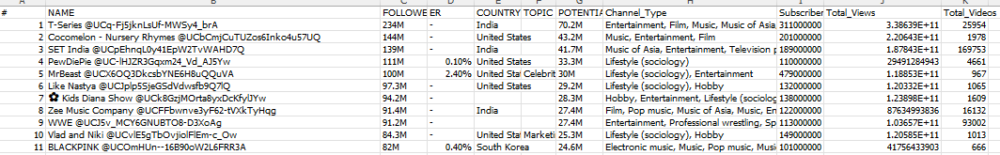
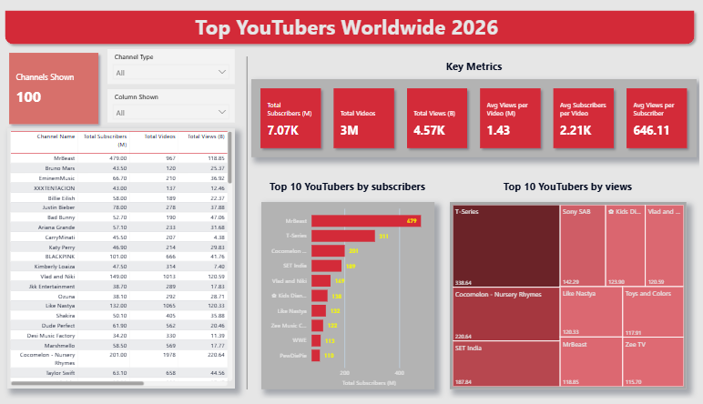

# YouTube2026-Marketing-Analytics-Project

# Table of Contents

- [Project Overview](#Project-Overview)
- [Objective](#objective)
- [Key Metrics & Scope](#Key-Metrics-&-Scope)
- [Data Source](#Data-Source)
- [Steps of Project](#Steps-of-Project)
- [Design](#Design)
  - [Dashboard Components Required](Dashboard-Components-Required)
  - [Dashboard mockup](#Dashboard-mockup)
  - [Tools](#Tools)
- [Developement](#Developement)
  - [Project Workflow](#Project-Workflow)
  - [Data Cleaning](#Data-Cleaning)
  - [Transform the Data](#Transform-the-Data)
  - [Create the SQL View](#Create-the-SQL-View)
- [Data Testing](#Data-Testing)
  - [Row Count Check](#Row-Count-Check)
  - [Column Count Check](#Column-Count-Check)
  - [Data Type Check](#Data-Type-Check)
  - [Duplicate Count Check](#Duplicate-Count-Check)
- [Visualization](#Visualization)
  - [Dax Measures](#Dax-Measures)
- [Analysis](#Analysis)
  - [Findinga](#Findinga)
  - [Validation](#Validation)
- [Recommendations](#Recommendations)
- [Discovery](#Discovery)


# Project Overview

This project aims to help the marketing team make effective decisions in selecting the Top YouTubers worldwide in 2026 for campaign collaborations as efficiently as possible.

It addresses the issue of scattered and inconsistent data through a systematic workflow, starting from collecting data from Kaggle, organizing and validating it using SQL, and presenting the results through a Power BI dashboard to analyze ROI and investment efficiency.

# Objective

To discover the top-performing YouTubers worldwide for marketing collaborations throughout 2026.

# KPIs & Scope

This project focuses on analyzing the Top YouTubers worldwide, using the following KPIs :

- subscriber count
- total views
- total videos, and
- engagement metrics

# Data Source 

Key data used in the analysis to achieve the project objectives.

- channel names
- total subscribers
- total views
- total videos uploaded

# Steps of Project

- Design
- Developement
- Testing
- Visualization
- Analysis

# Design 

## Dashboard Components Required 

1. Who are the top 10 YouTubers with the most subscribers?
2. Which 3 channels have uploaded the most videos?
3. Which 3 channels have the most views?
4. Which 3 channels have the highest average views per video?
5. Which 3 channels have the highest views per subscriber ratio?
6. Which 3 channels have the highest subscriber engagement rate per video uploaded?

## Dashboard mockup

## Tools

| Tool | Purpose |
| --- | --- |
| Excel | Exploring the data |
| SQL Server | Cleaning, testing, and analyzing the data |
| Power BI | Visualizing the data via interactive dashboards |

# Developement

## Project Workflow

1. Get the data
2. Explore the data in Excel
3. Load the data into SQL Server
4. Clean the data with SQL
5. Test the data with SQL
6. Visualize the data in Power BI
7. Generate the findings based on the insights

## Data Cleaning

- The NAME column contains both the channel name and the handle (ID) concatenated together, separated by the "@" symbol. To ensure analytical accuracy, it is necessary to extract only the channel name.
- To keep things simple, I've grouped the Channel Type column into just three categories: Entertainment, Music, and Others. This makes the data much easier to read and gives a better quick look at the big picture.



## Transform the Data

```sql

SELECT
    CAST(SUBSTRING(NAME, 1, CHARINDEX('@', NAME) - 1) AS VARCHAR(100)) AS channel_name,
    CASE 
        WHEN Channel_Type LIKE '%Entertainment%' THEN 'Entertainment'
        WHEN Channel_Type LIKE '%Music%' THEN 'Music'    
        ELSE 'Others'
    END AS channel_type,
    total_subscribers,
    total_videos,
    total_views
FROM 
    top_AllCountries_youtubers_2026

```

## Create the SQL View

```sql

CREATE VIEW view_AllCountries_youtubers_2026 AS
 
SELECT
    CAST(SUBSTRING(NAME, 1, CHARINDEX('@', NAME) - 1) AS VARCHAR(100)) AS channel_name,
    CASE 
        WHEN Channel_Type LIKE '%Entertainment%' THEN 'Entertainment'
        WHEN Channel_Type LIKE '%Music%' THEN 'Music'    
        ELSE 'Others'
    END AS channel_type,
    total_subscribers,
    total_videos,
    total_views
FROM 
    top_AllCountries_youtubers_2026

```

# Data Testing 

- Row count check
- Column count check
- Data type check
- Duplicate count check

## Row Count Check 
### SQL query
```sql

-- Count the total number of records (or rows) are in the SQL view

SELECT 
	COUNT(*) AS no_of_rows
FROM view_AllCountries_youtubers_2026

```
### Output


## Column Count Check 
### SQL query
```sql

-- Count the total number of columns (or fields) are in the SQL view

SELECT 
	COUNT(*) AS column_count
FROM INFORMATION_SCHEMA.COLUMNS
WHERE TABLE_NAME = 'view_AllCountries_youtubers_2026'

```
### Output


## Data Type Check 
### SQL query
```sql

-- Check the data types of each column from the view by checking the INFORMATION SCHEMA view

SELECT 
	COLUMN_NAME,
	DATA_TYPE
FROM INFORMATION_SCHEMA.COLUMNS
WHERE TABLE_NAME = 'view_AllCountries_youtubers_2026'

```
### Output


## Duplicate Count Check 
### SQL query
```sql

-- Duplicate count check

SELECT 
	channel_name , COUNT(*) AS duplicate_count
FROM view_AllCountries_youtubers_2026
GROUP BY channel_name
HAVING COUNT(*) > 1

```
### Output


# Visualization 



## Dax Measures

### 1. Total Subscribers (M)
```sql

Total Subscribers (M) = 
VAR million = 1000000
VAR sumOfSubscribers = SUM(view_AllCountries_youtubers_2026[total_subscribers])
VAR totalSubscribers = DIVIDE(sumOfSubscribers,million)
RETURN totalSubscribers

```

### 2. Total Views (B)
```sql

Total Views (B) = 
VAR billion = 1000000000
VAR sumOfView = sum(view_AllCountries_youtubers_2026[total_views])
VAR totalViews = DIVIDE(sumOfView,billion)
RETURN totalViews

```

### 3. Total Videos
```sql

Total Videos = 
VAR totalVideos = sum(view_AllCountries_youtubers_2026[total_videos])
RETURN totalVideos

```

### 4. Average Views Per Video (M)
```sql

Avg Views per Video (M) = 
VAR sumOfTotalViews = sum(view_AllCountries_youtubers_2026[total_views])
VAR sumOfTotalVideo = sum(view_AllCountries_youtubers_2026[total_videos])
VAR AvgViewsperVideo = DIVIDE(sumOfTotalViews,sumOfTotalVideo,BLANK())
VAR finalAvgViewsPerVideo = DIVIDE(AvgViewsperVideo,1000000,BLANK())
RETURN finalAvgViewsPerVideo

```

### 5. Average Subscribers Per Video
```sql

Avg Subscribers per Video = 
VAR sumOfTotalSubscribers = SUM(view_AllCountries_youtubers_2026[total_subscribers])
VAR sumOfTotalVideo = SUM(view_AllCountries_youtubers_2026[total_videos])
VAR SubscribersperVideo = DIVIDE(sumOfTotalSubscribers,sumOfTotalVideo,BLANK())
RETURN SubscribersperVideo

```

### 6. Average Views Per Subscriber
```sql

Avg Views per Subscriber = 
VAR sumOfTotalViews = sum(view_AllCountries_youtubers_2026[total_views])
VAR sumOfTotalSubscriber = sum(view_AllCountries_youtubers_2026[total_subscribers])
VAR viewsPerSubscriber = DIVIDE(sumOfTotalViews,sumOfTotalSubscriber,BLANK())
RETURN viewsPerSubscriber

```

# Analysis

## Findings

 For this analysis, I'll be focusing on the questions below to grab the key insights we need for our marketing.

1. Who are the top 10 YouTubers with the most subscribers?
2. Which 3 channels have uploaded the most videos?
3. Which 3 channels have the most views?
4. Which 3 channels have the highest average views per video?
5. Which 3 channels have the highest views per subscriber ratio?
6. Which 3 channels have the highest subscriber engagement rate per video uploaded?

### 1. Who are the top 10 YouTubers with the most subscribers?

| Rank | Channel Name                | Total Subscribers (M) |
|------|-----------------------------|-----------------------|
| 1    | MrBeast                     | 479.00                |
| 2    | T-Series                    | 311.00                |
| 3    | Cocomelon - Nursery Rhymes  | 201.00                |
| 4    | SET India                   | 189.00                |
| 5    | Vlad and Niki               | 149.00                |
| 6    | ✿ Kids Diana Show           | 138.00                |
| 7    | Like Nastya                 | 132.00                |
| 8    | Zee Music Company           | 122.00                |
| 9    | WWE                         | 113.00                |
| 10   | PewDiePie                   | 110.00                |

### 2. Which 3 channels have uploaded the most videos?

| Rank | Channel Name | Total Videos |
|------|--------------|--------------|
| 1    | VEGETTA777   | 8,802        |
| 2    | Ishtar Music | 6,491        |
| 3    | Felipe Neto  | 6,274        |

### 3. Which 3 channels have the most views?


| Rank | Channel Name      | Total Views (B) |
|------|-------------------|-----------------|
| 1    | ✿ Kids Diana Show | 123.90          |
| 2    | Vlad and Niki     | 120.59          |
| 3    | Like Nastya       | 120.33          |


### 4. Which 3 channels have the highest average views per video?

| Rank | Channel Name | Avg Views per Video (M) |
|------|--------------|-------------------------|
| 1    | Bad Bunny    | 247.68                  |
| 2    | Bruno Mars   | 211.42                  |
| 3    | Katy Perry   | 139.40                  |


### 5. Which 3 channels have the highest average views per subscriber?

| Rank | Channel Name    | Avg Views per Subscriber |
|------|-----------------|--------------------------|
| 1    | Ryan's World    | 1,571.42                 |
| 2    | Toys and Colors | 1,430.95                 |
| 3    | Alfredo Larin   | 1,040.89                 |


### 6. Which 3 channels have the highest average subscribers per video?

| Rank | Channel Name  | Avg Subscribers per Video |
|------|---------------|---------------------------|
| 1    | MrBeast       | 495,346.43                |
| 2    | Bruno Mars    | 362,500.00                |
| 3    | Billie Eilish | 306,878.31                |

### Notes

In this analysis, I'll be focusing on the key metrics that drive our expected ROI (Return on Investment). 

These include :

- Total Subscribers

- Total Videos

- Total Views

- Average Views per Video

- Average Subscribers per Video

- Average Views per Subscriber

## Validation 

### 1. Total Subscribers Analysis (Top 3 by subscribers)

#### Calculation breakdowns

Campaign idea = Product Placement

1. MrBeast
- Average views per video = 122.91 million
- Product cost = $5
- Potential Product Sales per video = 122.91 million x 2% conversion rate = 2,458,200 units 
- Potential revenue per video = 2,458,200 x $5 = $12,291,000
- Campaign cost (one-time fee) = $50,000
- **Net profit = $12,291,000 - $50,000 = $12,241,000**

2. Vlad and Niki 
- Average views per video = 119.04 million
- Product cost = $5
- Potential Product Sales per video =  119.04 million x 2% conversion rate =  2,485,200 units 
- Potential revenue per video =  x $5 = $11,904,000
- Campaign cost (one-time fee) = $50,000
- **Net profit = $11,904,000 - $50,000 = 11,854,000**

3. Kids Diana Show
- Average views per video = 77.00 million
- Product cost = $5
- Potential Product Sales per video = 77.00M x 2% = 1,540,000 units
- Potential revenue per video = 1,540,000 x $5 = $7,700,000
- Campaign cost (one-time fee) = $50,000
- **Net profit = $7,700,000 - $50,000 = $7,650,000**

Best option : MrBeast

#### SQL query
```sql
-- 1. Total Subscribers Analysis (Top 3 by subscriber)

DECLARE @conversionRate FLOAT = 0.02 ;
DECLARE @productCost FLOAT = 5.0 ;
DECLARE @campaignCost FLOAT = 50000.0 ;

WITH ChannelData AS 
(
SELECT 
	channel_name,
	total_views,
	total_videos,
	ROUND(CAST(total_views AS FLOAT) / total_videos, -4) AS rounded_avg_views_per_video
FROM 
	view_AllCountries_youtubers_2026
)
SELECT 
	channel_name,
	rounded_avg_views_per_video,
	(rounded_avg_views_per_video * @conversionRate) AS Potential_Product_Sales_Per_Video,
	(rounded_avg_views_per_video * @conversionRate) * @productCost AS Potential_revenue_per_video,
	((rounded_avg_views_per_video * @conversionRate) * @productCost) - @campaignCost AS Net_profit
FROM 
	ChannelData
WHERE 
	channel_name IN ('MrBeast','Vlad and Niki','✿ Kids Diana Show')
ORDER BY 
	Net_profit DESC
```
### 2. Total Videos Analysis (Top 3 by videos)

#### Calculation breakdowns

Campaign idea = Sponsored video series (11 vids) **$5000/video**

1. VEGETTA777
- Average views per video = 1.86 million
- Product cost = $5
- Potential Product Sales per video = 1.86M x 2% = 37,200 units
- Potential revenue per video = 37,200 x $5 = $186,000
- Campaign cost = $55,000
- **Net profit = $186,000 - $55,000 = $131,000**

2. Ishtar Music
- Average views per video = 4.38 million
- Product cost = $5
- Potential Product Sales per video = 4.38M x 2% = 87,600 units
- Potential revenue per video = 87,600 x $5 = $438,000
- Campaign cost = $55,000
- **Net profit = $438,000 - $55,000 = $383,000**

3. Felipe Neto
- Average views per video = 3.10 million
- Product cost = $5
- Potential Product Sales per video = 3.10M x 2% = 62,000 units
- Potential revenue per video = 62,000 x $5 = $310,000
- Campaign cost = $55,000
- **Net profit = $310,000 - $55,000 = $255,000**

Best option : Ishtar Music

#### SQL query
```sql
-- 2. Total Videos Analysis (Top 3 by videos)

DECLARE @conversionRate FLOAT = 0.02 ;
DECLARE @productCost FLOAT = 5.0 ;
DECLARE @campaignCost FLOAT = 55000.0 ;

WITH ChannelData AS
(
SELECT
	channel_name,
	total_views,
	total_videos,
	ROUND(CAST(total_views AS FLOAT)/total_videos ,-4) AS rounded_avg_views_per_video
FROM 
	view_AllCountries_youtubers_2026	
)
SELECT 
	channel_name,
	rounded_avg_views_per_video,
	rounded_avg_views_per_video * @conversionRate AS Potential_Product_Sales_Per_Video,
	(rounded_avg_views_per_video * @conversionRate) * @productCost AS Potential_revenue_per_video,
	((rounded_avg_views_per_video * @conversionRate) * @productCost) - @campaignCost AS Net_profit
FROM 
	ChannelData
WHERE 
	channel_name IN ('VEGETTA777','Ishtar Music','Felipe Neto')
ORDER BY 
	Net_profit DESC
```

### 3. Total Views Analysis (Top 3 by views)

#### Calculation breakdowns

Campaign idea = Product Placement

1. ✿ Kids Diana Show
- Average views per video = 77.00 million
- Product cost = $5
- Potential Product Sales per video = 77.00M x 2% = 1,540,000 units
- Potential revenue per video = 1,540,000 x $5 = $7,700,000
- Campaign cost (one-time fee) = $50,000
- **Net profit = $7,700,000 - $50,000 = $7,650,000**

2. Vlad and Niki
- Average views per video = 119.04 million
- Product cost = $5
- Potential Product Sales per video = 119.04M x 2% = 2,380,800 units
- Potential revenue per video = 2,380,800 x $5 = $11,904,000
- Campaign cost (one-time fee) = $50,000
- **Net profit = $11,904,000 - $50,000 = $11,854,000**

3. Like Nastya
- Average views per video = 112.99 million
- Product cost = $5
- Potential Product Sales per video = 112.99M x 2% = 2,259,800 units
- Potential revenue per video = 2,259,800 x $5 = $11,299,000
- Campaign cost (one-time fee) = $50,000
- **Net profit = $11,299,000 - $50,000 = $11,249,000**

Best option : Vlad and Niki

#### SQL query
```sql
-- 3. Total Views Analysis (Top 3 by views)

DECLARE @conversionRate FLOAT = 0.02 ;
DECLARE @productCost FLOAT = 5.0 ;
DECLARE @campaignCost FLOAT = 50000.0 ;

WITH ChannelData AS
(
SELECT
	channel_name,
	total_views,
	total_videos,
	ROUND(CAST(total_views AS FLOAT)/total_videos ,-4) AS rounded_avg_views_per_video
FROM 
	view_AllCountries_youtubers_2026	
)
SELECT 
	channel_name,
	rounded_avg_views_per_video,
	rounded_avg_views_per_video * @conversionRate AS Potential_Product_Sales_Per_Video,
	(rounded_avg_views_per_video * @conversionRate) * @productCost AS Potential_revenue_per_video,
	((rounded_avg_views_per_video * @conversionRate) * @productCost) - @campaignCost AS Net_profit
FROM 
	ChannelData
WHERE 
	channel_name IN ('✿ Kids Diana Show','Vlad and Niki','Like Nastya')
ORDER BY 
	Net_profit DESC
```

### 4. Avg views per video Analysis (Top 3 by avg views per video)

#### Calculation breakdowns

Campaign idea = Sponsored video series (11 vids) **$5000/video**

1. Bad Bunny
- Average views per video = 247.68 million
- Product cost = $5
- Potential Product Sales per video = 247.68M x 2% = 4,953,600 units
- Potential revenue per video = 4,953,600 x $5 = $24,768,000
- Campaign cost = $55,000
- **Net profit = $24,768,000 - $55,000 = $24,713,000**

2. Bruno Mars
- Average views per video = 211.42 million
- Product cost = $5
- Potential Product Sales per video = 211.42M x 2% = 4,228,400 units
- Potential revenue per video = 4,228,400 x $5 = $21,142,000
- Campaign cost = $55,000
- **Net profit = $21,142,000 - $55,000 = $21,087,000**

3. Katy Perry
- Average views per video = 139.40 million
- Product cost = $5
- Potential Product Sales per video = 139.40M x 2% = 2,788,000 units
- Potential revenue per video = 2,788,000 x $5 = $13,940,000
- Campaign cost = $55,000
- **Net profit = $13,940,000 - $55,000 = $13,885,000**

Best option : Bad Bunny

#### SQL query
```sql
-- 4. Avg views per video Analysis (Top 3 by avg views per video)

DECLARE @conversionRate FLOAT = 0.02 ;
DECLARE @productCost FLOAT = 5.0 ;
DECLARE @campaignCost FLOAT = 55000.0 ;

WITH ChannelData AS 
(
SELECT 
	channel_name,
	total_views,
	total_videos,
	ROUND(CAST(total_views AS FLOAT) / total_videos, -4) AS rounded_avg_views_per_video
FROM 
	view_AllCountries_youtubers_2026
)
SELECT 
	channel_name,
	rounded_avg_views_per_video,
	(rounded_avg_views_per_video * @conversionRate) AS Potential_Product_Sales_Per_Video,
	(rounded_avg_views_per_video * @conversionRate) * @productCost AS Potential_revenue_per_video,
	((rounded_avg_views_per_video * @conversionRate) * @productCost) - @campaignCost AS Net_profit
FROM 
	ChannelData
WHERE 
	channel_name IN ('Bad Bunny','Bruno Mars','Katy Perry')
ORDER BY 
	Net_profit DESC
```

### 5. Avg subscribers per video Analysis (Top 3 by avg subs per vid)

#### Calculation breakdowns

Campaign idea = Influencer Marketing

1. MrBeast
- Average views per video = 122.91 million
- Product cost = $5
- Potential Product Sales per video = 122.91M x 2% = 2,458,200 units
- Potential revenue per video = 2,458,200 x $5 = $12,291,000
- Campaign cost (one-time fee) = $130,000
- **Net profit = $12,291,000 - $130,000 = $12,161,000**

2. Bruno Mars
- Average views per video = 211.42 million
- Product cost = $5
- Potential Product Sales per video = 211.42M x 2% = 4,228,400 units
- Potential revenue per video = 4,228,400 x $5 = $21,142,000
- Campaign cost (one-time fee) = $130,000
- **Net profit = $21,142,000 - $130,000 = $21,012,000**

3. Billie Eilish
- Average views per video = 118.35 million
- Product cost = $5
- Potential Product Sales per video = 118.35M x 2% = 2,367,000 units
- Potential revenue per video = 2,367,000 x $5 = $11,835,000
- Campaign cost (one-time fee) = $130,000
- **Net profit = $11,835,000 - $130,000 = $11,705,000**

Best option : Bruno Mars

#### SQL query
```sql
-- 5. Avg subscribers per video Analysis (Top 3 by avg subs per vid)

DECLARE @conversionRate FLOAT = 0.02 ;
DECLARE @productCost FLOAT = 5.0 ;
DECLARE @campaignCost FLOAT = 130000.0 ;

WITH ChannelData AS
(
SELECT
	channel_name,
	total_views,
	total_videos,
	ROUND(CAST(total_views AS FLOAT)/total_videos ,-4) AS rounded_avg_views_per_video
FROM 
	view_AllCountries_youtubers_2026	
)
SELECT 
	channel_name,
	rounded_avg_views_per_video,
	rounded_avg_views_per_video * @conversionRate AS Potential_Product_Sales_Per_Video,
	(rounded_avg_views_per_video * @conversionRate) * @productCost AS Potential_revenue_per_video,
	((rounded_avg_views_per_video * @conversionRate) * @productCost) - @campaignCost AS Net_profit
FROM 
	ChannelData
WHERE 
	channel_name IN ('MrBeast','Bruno Mars','Billie Eilish')
ORDER BY 
	Net_profit DESC
```

### 6. Avg views per subscriber Analysis (Top 3 by avg views per sub)

#### Calculation breakdowns

Campaign idea = Influencer Marketing

1. Ryan's World
- Average views per video = 17.20 million
- Product cost = $5
- Potential Product Sales per video = 17.20M x 2% = 344,000 units
- Potential revenue per video = 344,000 x $5 = $1,720,000
- Campaign cost (one-time fee) = $130,000
- **Net profit = $1,720,000 - $130,000 = $1,590,000**

2. Toys and Colors
- Average views per video = 65.04 million
- Product cost = $5
- Potential Product Sales per video = 65.04M x 2% = 1,300,800 units
- Potential revenue per video = 1,300,800 x $5 = $6,504,000
- Campaign cost (one-time fee) = $130,000
- **Net profit = $6,504,000 - $130,000 = $6,374,000**

3. Alfredo Larin
- Average views per video = 27.67 million
- Product cost = $5
- Potential Product Sales per video = 27.67M x 2% = 553,400 units
- Potential revenue per video = 553,400 x $5 = $2,767,000
- Campaign cost (one-time fee) = $130,000
- **Net profit = $2,767,000 - $130,000 = $2,637,000**

Best option : Toys and Colors

#### SQL query
```sql
-- 6. Avg views per subscriber Analysis (Top 3 by avg views per sub)

DECLARE @conversionRate FLOAT = 0.02 ;
DECLARE @productCost FLOAT = 5.0 ;
DECLARE @campaignCost FLOAT = 130000.0 ;

WITH ChannelData AS
(
SELECT
	channel_name,
	total_views,
	total_videos,
	ROUND(CAST(total_views AS FLOAT)/total_videos ,-4) AS rounded_avg_views_per_video
FROM 
	view_AllCountries_youtubers_2026	
)
SELECT 
	channel_name,
	rounded_avg_views_per_video,
	rounded_avg_views_per_video * @conversionRate AS Potential_Product_Sales_Per_Video,
	(rounded_avg_views_per_video * @conversionRate) * @productCost AS Potential_revenue_per_video,
	((rounded_avg_views_per_video * @conversionRate) * @productCost) - @campaignCost AS Net_profit
FROM 
	ChannelData
WHERE 
	channel_name IN ( 'Ryan''s World','Toys and Colors','Alfredo Larin')
ORDER BY 
	Net_profit DESC
```

# Recommendations

## 1. Total Subscribers Analysis (Top 3 by subscribers)

MrBeast is the most highly recommended channel for partnership, with a projected subscriber base reaching 479 million and an impressive average of 122.9 million views per video. This immense reach translates into a potential net profit of $12,241,000 per campaign. Given his massive global audience, a single product placement can achieve instantaneous worldwide exposure. This ensures an exceptionally low cost-per-impression (CPM) while delivering maximum marketing efficiency and brand impact.

## 2. Total Videos Analysis (Top 3 by videos)

Net profits in this category are significantly lower than other groups because, despite having a high volume of videos, the average views per video remain relatively low. However, Ishtar Music emerges as the best performer within this segment, generating a net profit of $383,000. While Ishtar Music is the recommended choice if a selection must be made from this group, it is worth noting that the $55,000 budget might yield a much higher return on investment (ROI) if reallocated to creators in other high-performing categories instead.

## 3. Total Views Analysis (Top 3 by views)

Vlad and Niki should be the primary choice, delivering the highest net profit in this category at $11,854,000, followed closely by Like Nastya at $11,249,000. Both channels boast exceptionally high total views and maintain an average of over 100 million views per video, resulting in incredibly strong potential sales. While Kids Diana Show ranks within the top three for total views, its net profit remains significantly lower than the top two performers, making it a secondary option.

## 4. Avg views per video Analysis (Top 3 by avg views per video)

Bad Bunny delivers the highest net profit at $24,713,000, driven by an extraordinary average of 247.68 million views per video. This reflects a consistent "viral" performance for every upload. Given the campaign cost of only $55,000, this represents an exceptionally high return on investment (ROI). Bruno Mars also stands out as an excellent secondary option. Both creators are world-class music artists with massive, diverse global fanbases, ensuring widespread brand exposure.

## 5. Avg subscribers per video Analysis (Top 3 by avg subs per vid) 

Bruno Mars delivers the highest net profit in this category. Although MrBeast shows strong performance, Bruno Mars maintains a significantly higher average views per video, leading to superior net profit results. Billie Eilish ranks as a strong secondary option but does not yet match the profit levels achieved by Bruno Mars. Consequently, Bruno Mars is the most recommended channel to select within this group.

## 6. Avg views per subscriber Analysis (Top 3 by avg views per sub)

Toys and Colors delivers the highest net profit in this category due to its exceptionally high average views per video, reflecting superior audience engagement. While Ryan's World maintains a strong and established presence, a direct comparison shows that Toys and Colors generates significantly higher revenue and net profit. Therefore, Toys and Colors represents the most cost-effective and high-return investment choice within this group.

# Discovery

When looking at the overall picture with ROI as the main focus, **MrBeast** stands out as the most cost-effective choice. He doesn’t just perform well in one area, but consistently does well across multiple metrics. His videos get high and steady views, and his strong engagement can actually turn into real business results. Because of this, his ROI is not only high but also more stable and less risky compared to other channels.


